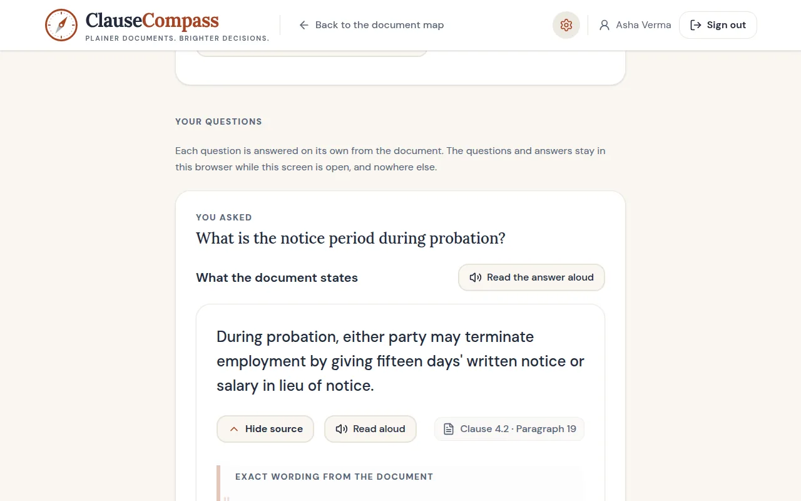
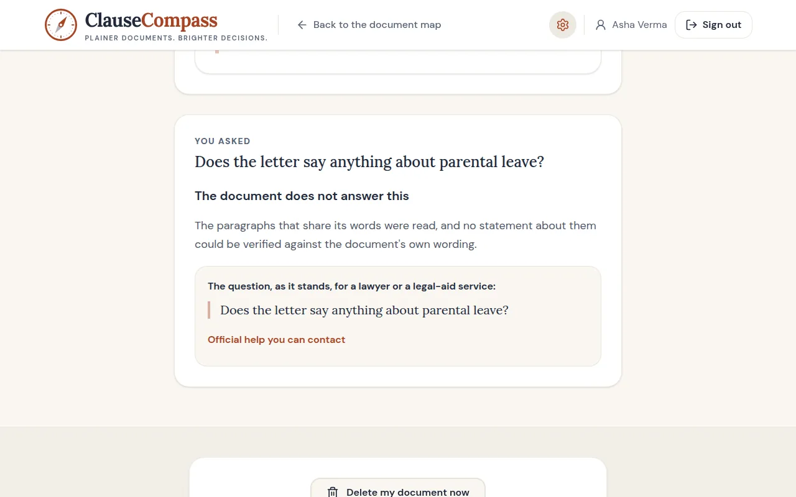
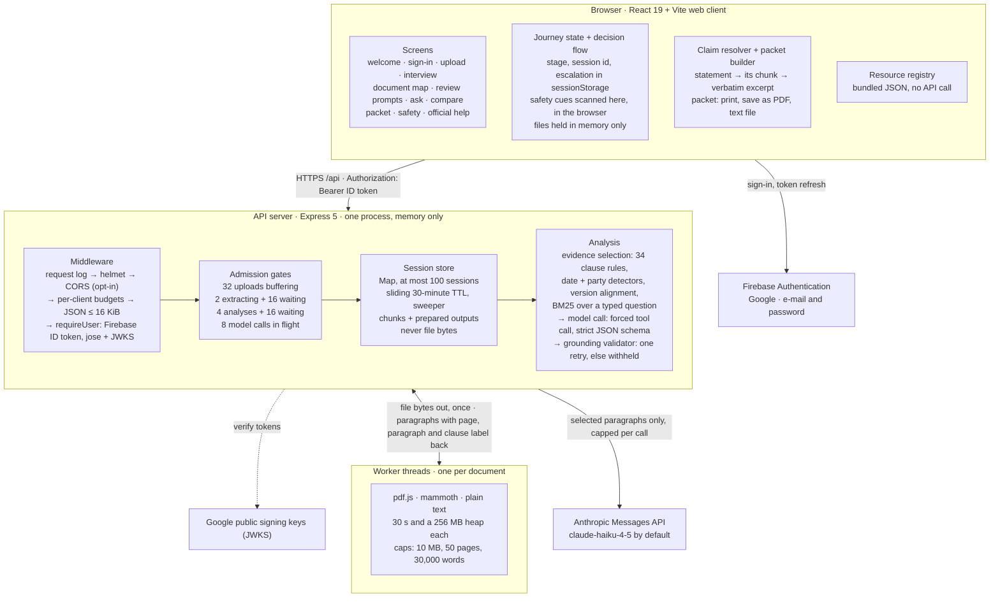
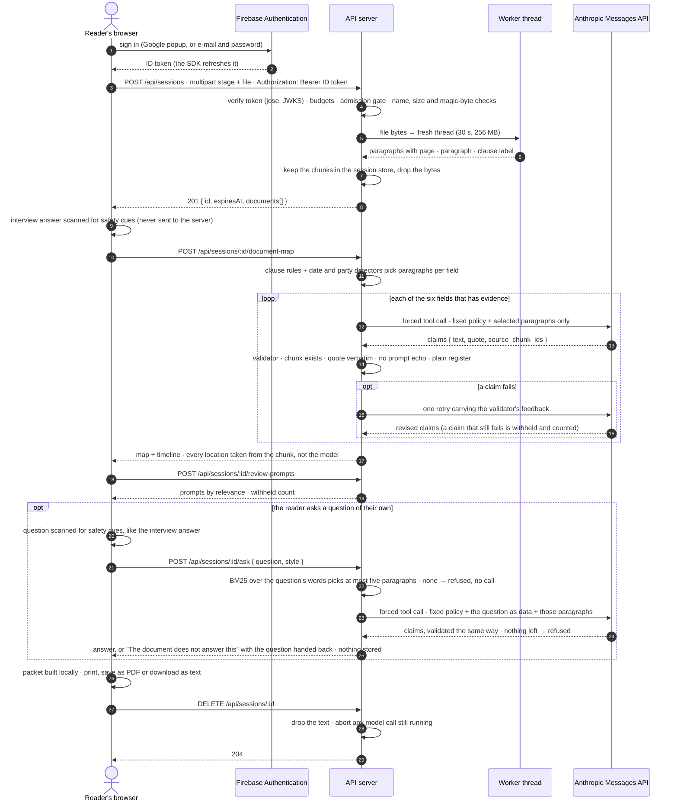
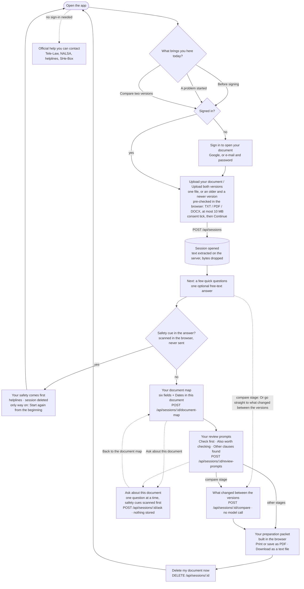
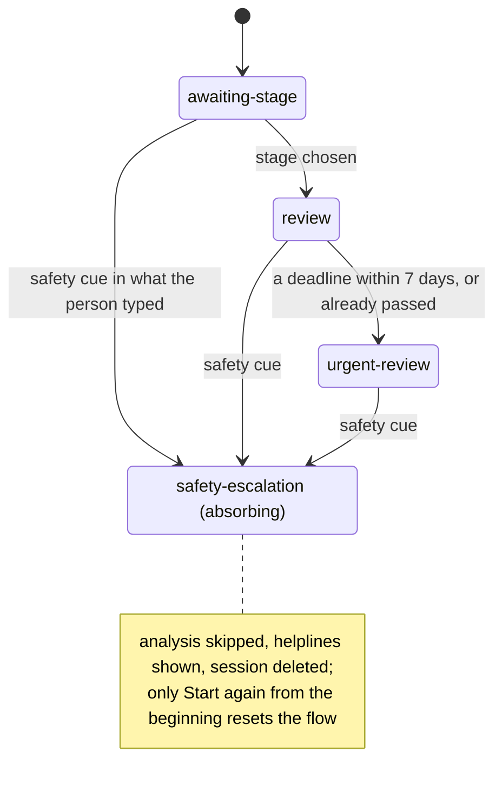
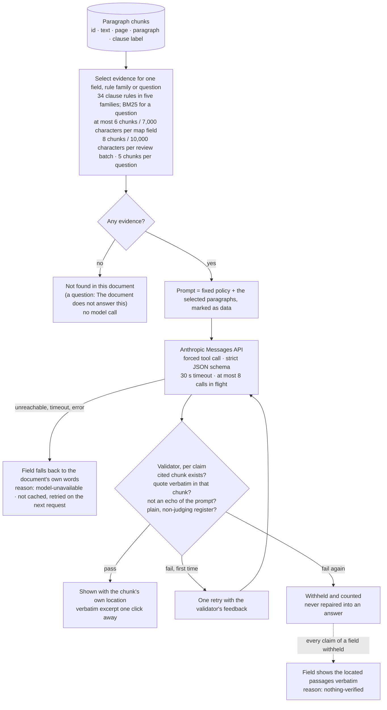
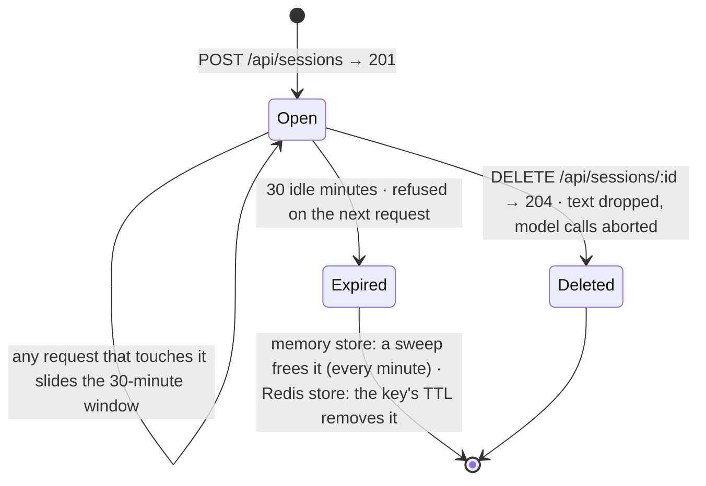

<a id="top"></a>

<p align="center">
  
</p>

<h1 align="center">ClauseCompass</h1>

<p align="center"><b>Plain-language navigation for legal documents.</b></p>

<p align="center">Upload an offer letter, a rent agreement or an NDA. ClauseCompass shows who it binds and to what, the dates and amounts in it, review prompts for the clauses that matter in your situation, an answer to your own question from the document's wording (or a plain "the document does not answer this"), and a packet to take to a lawyer or a free legal-aid service. Every statement it makes about the document points at the paragraph it came from.</p>

<p align="center">
  <a href="https://github.com/adityarajgupta154/ClauseCompass/actions/workflows/ci.yml"></a>
  
  
  
  
  
  
</p>

<p align="center">
  <a href="#chosen-vertical">Why</a> ·
  <a href="#what-it-looks-like">Screens</a> ·
  <a href="#how-it-works">How it works</a> ·
  <a href="#the-ai-assistant-ask-about-this-document">AI assistant</a> ·
  <a href="#setup">Run it</a> ·
  <a href="#demo-walkthrough-priya">Walkthrough</a> ·
  <a href="#api">API</a> ·
  <a href="#evaluation-evidence">Evidence</a> ·
  <a href="#faq">FAQ</a> ·
  <a href="#documentation">Docs</a>
</p>

> [!IMPORTANT]
> ClauseCompass explains documents; it does not give legal advice. It does not say whether a clause is enforceable, what will happen, whether you qualify for a service, or what to do. It ends in a handoff to the people and services that can: a lawyer, or the free legal-aid channels on its help screen.

Built for the Hack2Skill 2026 hackathon. The requirements this build follows are in [docs/PRD.md](docs/PRD.md); [docs/README.md](docs/README.md) maps each step of the pipeline to the files that implement it.

## Pick your path

| Judging or reading | Running it | Building on it |
| --- | --- | --- |
| [Chosen vertical](#chosen-vertical) → [Problem & approach](#problem--approach) → [What it looks like](#what-it-looks-like) → [The AI assistant](#the-ai-assistant-ask-about-this-document) → [Demo walkthrough](#demo-walkthrough-priya) → [Evaluation evidence](#evaluation-evidence) → [Assumptions & limitations](#assumptions--limitations) | [Setup](#setup): [quick start](#quick-start), [running it without any keys](#running-it-without-any-keys), [environment variables](#environment-variables), [preflight](#preflight-before-a-submission-attempt) | [System architecture](#system-architecture) → [How it works](#how-it-works) → [Decision flow](#decision-flow) → [Grounding](#grounding-how-a-statement-earns-its-place-on-screen) → [API](#api) → [Repository layout](#repository-layout) → [Documentation](#documentation) |

## At a glance

| | |
| --- | --- |
| **Situations** | Three, chosen on the first screen: **before signing**, **a problem started**, **compare two versions**. Everything after that is chosen for the stage. |
| **Documents** | TXT, PDF and DOCX up to 10 MB; PDFs up to 50 pages; 30,000 words. No OCR: scans are refused with a message saying so. |
| **Clause rules** | 34, in five families (money, time, duty, exit & remedies, data & IP); each says at which stages it leads. They pick the paragraphs, not the model. |
| **The map** | Six fields: Who is bound by it · How long it lasts · Money · Duties and restrictions · How it can end · If there is a dispute, plus the dates timeline; every statement opens to the paragraph it rests on. |
| **The AI assistant** | **Ask about this document**: a question in English or Hinglish, answered from the paragraphs that share its words (at most five, chosen by BM25 with a lay and Hinglish synonym table), one to three statements each quoting the document, or **"The document does not answer this"** with the question handed back for a lawyer or a legal-aid service. It is grounded, not open-ended: no paragraph, no model call; no verified quote, no statement. See [The AI assistant](#the-ai-assistant-ask-about-this-document). |
| **What the model sees** | Only the paragraphs selected for one map field, one rule family or one question, under a per-call cap; never the reader's identity or the interview answer. |
| **What the model may not do** | Judge, predict or advise. A validator checks every sentence against its cited paragraph before it is shown; a sentence that fails twice is withheld and counted. |
| **What the server keeps** | Extracted text and prepared outputs, for a sliding 30 minutes or until "Delete my document now"; never the uploaded bytes. In the API process's memory by default; on a host that runs an instance per request, in a Redis database it owns, every document and output encrypted before it is written (see [Sessions](#request-handling-limits-and-session-lifecycle)). |
| **Handoff** | A printable preparation packet and a page of official services: Tele-Law, NALSA legal aid, the 1915, 1930, 112, 181 and 1098 helplines, SHe-Box. |
| **Stack** | React 19 + Vite web client, Express 5 API on Node 22.13+, shared pure-TypeScript libraries, Firebase Authentication for sign-in, the Anthropic Messages API for the restatements. |

## Chosen vertical

Legal document navigation for India, at the moment an ordinary person has to read a document without help: an employment offer letter, a leave-and-licence (rent) agreement, a non-disclosure agreement. The product is stage-aware: the first screen asks whether you are **before signing**, **a problem started**, or want to **compare two versions**, and everything after that is chosen for that stage. It ends in a handoff to services that already exist (Tele-Law, NALSA legal aid, the 1915, 1930, 112, 181 and 1098 helplines, SHe-Box) rather than trying to replace them.

Demo persona: **Priya, 24, first job offer, "Before signing".** She wants to understand salary, joining date, probation, notice period and the IP and non-compete wording, and to walk into HR with specific questions. The [walkthrough](#demo-walkthrough-priya) below is her path.

## Problem & approach

Three gaps, taken from the PRD:

1. Formal consultation costs ₹1,500–5,000 an hour in metro cities, which is out of reach for an everyday contract as opposed to a lawsuit.
2. India already has a first-mile channel. Tele-Law has given more than 1.12 crore pre-litigation advices through Common Service Centres. The gap is not that help does not exist; it is that people cannot describe their problem well enough to use it, and many do not know it exists.
3. At the point of signing, what matters is specific clauses: notice, bond, lock-in, liability cap, arbitration. A general chat tool blurs "explaining this clause" with "advising you about it", which is unsafe and reads as legal advice.

A chatbot answers whatever is typed, from its training data, in a voice that sounds like advice. ClauseCompass is built the other way round: **document → decision → handoff**.

- **Document.** The uploaded text is the only source. It is split into paragraphs, and every statement the model writes about the document carries the id of the paragraph it came from and a quote copied from it. The interface resolves that id before it shows the statement; a statement whose source cannot be found is not shown. A question the reader types is answered the same way, from the paragraphs that share its words, or not at all: "The document does not answer this", with the question handed back to take to a professional. (Fixed interface text, the registry's "why it matters" notes and the comparison's summaries are product copy, not model output.)
- **Decision.** What the product does next is decided by a deterministic flow, never by the model: the stage the user chose, a safety-cue scan of the one free-text answer (force or harm to a person ends the document flow and shows helplines), and a registry of 34 clause rules in five families (money, time, duty, exit & remedies, data & IP) that selects the paragraphs worth reviewing for that stage. The model's job is narrow: restate the selected paragraphs in plain language, in a format a validator checks before anything reaches the screen. Statements that judge, predict or advise are rejected and withheld.
- **Handoff.** The output is a preparation packet: the map, the dates, the review prompts as questions to ask, a checklist of records to gather, the citations and the disclaimers, with the official services that fit the situation one link away. It is meant to be printed and carried to a human.

Out of scope on purpose (PRD §3): legal advice, outcome prediction, eligibility decisions, drafting notices, and any claim that model output states Indian law.

## Which situation are you in?

The first screen asks **"What brings you here today?"**. The choice decides two things. Each of the 34 clause rules says whether it is primary, secondary or neither at that stage, and that is what puts its prompt under **"Check first"**, **"Also worth checking"** or **"Other clauses found"**; the stage plan ([`lib/rules/src/stage-plans.ts`](lib/rules/src/stage-plans.ts)) then gives the order in which the five rule families sort the prompts inside each group. The interview's one question is the same at every stage; the compare stage adds one screen, **"What changed between the versions"**, and a way to skip straight to it.

<details>
<summary><b>Before signing</b> · an offer letter, rent agreement, NDA or loan you have been asked to sign</summary>

The app's words for it: *"An offer letter, rent agreement, NDA or loan you have been asked to sign. See what the document says you would be agreeing to, and what to ask before you do."* For example: a first job offer, or an NDA a client has sent over.

- **Family order inside each group:** duty → time → exit & remedies → money → data & IP.
- **Path:** upload → one optional question → document map → review prompts → preparation packet, with the questions to ask. From the map or the prompts, **"Ask about this document"** takes a question of your own and comes back.
- **Sample to try:** *Employment offer letter*, the one in the [walkthrough](#demo-walkthrough-priya) below.

</details>

<details>
<summary><b>A problem started</b> · a dispute, notice or missed payment on an agreement you already signed</summary>

The app's words for it: *"A dispute, notice or missed payment on an agreement you already signed. Find the wording that talks about it and build a dated timeline of what happened."* For example: a landlord's message about leaving, or a deposit that has not come back.

- **Family order inside each group:** exit & remedies → time → money → duty → data & IP.
- **Path:** the same screens, with the exit & remedies and time families sorted first; the interview answer is scanned for safety cues here as everywhere, and a cue ends the document flow and shows the helplines instead.
- **Sample to try:** *Leave and licence (rent) agreement*.

</details>

<details>
<summary><b>Compare two versions</b> · an old and a new version of terms, a policy or a contract</summary>

The app's words for it: *"An old and a new version of terms, a policy or a contract. See what changed, clause by clause, in plain language."* For example: a subscription's updated terms, or a renewal with changed rent or fees.

- **Family order inside each group:** money → time → duty → exit & remedies → data & IP.
- **Path:** an older and a newer file → the question → map → prompts → **"What changed between the versions"** → packet. From the interview screen, **"Or go straight to what changed between the versions"** skips the map and prompts. Comparison is deterministic: no model call.
- **Samples to try:** *Leave and licence (rent) agreement* as the older version, *Leave and licence agreement, revised draft* as the newer.

</details>

## What it looks like

Every picture below is the app as built, taken from the sample documents by [`scripts/docs/screenshots.mjs`](scripts/docs/screenshots.mjs). Everything in them is synthetic: the documents, every name, amount and date in them, and the reader signed in through the offline stand-in; the one real date is the day the packet was prepared. The map, prompt, answer and packet sentences are the model's output from that run, so a re-run words them differently.

<table>
  <tr>
    <td width="50%" valign="top"><br><sub><b>Upload your document</b> · one file, or two versions to compare, pre-checked in the browser; how the document is handled is stated before anything is sent, and four synthetic samples are one press away.</sub></td>
    <td width="50%" valign="top"><br><sub><b>Next: a few quick questions</b> · one optional answer about the situation, scanned for safety cues in the browser and never sent to the server.</sub></td>
  </tr>
  <tr>
    <td width="50%" valign="top"><br><sub><b>Your document map</b> · six fields plus the dates; each statement carries the paragraph it rests on.</sub></td>
    <td width="50%" valign="top"><br><sub><b>Show source</b> · the paragraph a statement rests on, quoted verbatim with its location; nothing the model wrote is shown without it.</sub></td>
  </tr>
  <tr>
    <td width="50%" valign="top"><br><sub><b>Your review prompts</b> · grouped into Check first, Also worth checking and Other clauses found by the rule's relevance at this stage; each prompt shows the clause and why it matters.</sub></td>
    <td width="50%" valign="top"><br><sub><b>Your preparation packet</b> · the map, the dates, the questions to ask, the records to gather and the citations, built in the browser; print, save as PDF or download as text.</sub></td>
  </tr>
  <tr>
    <td width="50%" valign="top"><br><sub><b>Ask about this document</b> · a question in the reader's own words, answered only with statements that rest on the document's wording, each with its clause and the exact text one press away.</sub></td>
    <td width="50%" valign="top"><br><sub><b>The document does not answer this</b> · a question the document does not settle is refused with the reason and handed back word for word to take to a professional; no guess.</sub></td>
  </tr>
</table>

<details>
<summary><b>More screens</b> · comparison, safety, official help, the stage question, the two-version upload, sign-in, a phone</summary>

<table>
  <tr>
    <td width="50%" valign="top"><br><sub><b>What changed between the versions</b> · each change classified by kind (money, time, duty, remedy, wording) and each side quoted; no model call.</sub></td>
    <td width="50%" valign="top"><br><sub><b>Your safety comes first</b> · a safety cue in the interview answer ends the document flow, clears what the browser held, asks the server to delete the session (the screen says whether that was confirmed) and shows the helplines.</sub></td>
  </tr>
  <tr>
    <td width="50%" valign="top"><br><sub><b>Official help you can contact</b> · the curated registry of official services, each entry sourced and dated, open without sign-in.</sub></td>
    <td width="50%" valign="top"><br><sub><b>What brings you here today?</b> · the three situations, each with what it is for and an example.</sub></td>
  </tr>
  <tr>
    <td width="50%" valign="top"><br><sub><b>Upload both versions</b> · an older and a newer file for the comparison stage.</sub></td>
    <td width="50%" valign="top"><br><sub><b>Sign in to open your document</b> · the document journey is behind Firebase Authentication (Google, or e-mail and password); the welcome, help and safety screens stay open without it.</sub></td>
  </tr>
  <tr>
    <td colspan="2" align="center"><br><sub><b>On a phone</b> · the same document map at 390 pixels wide.</sub></td>
  </tr>
</table>

</details>

<p align="center">
  <picture>
    <source media="(prefers-color-scheme: dark)" srcset="docs/screenshots/welcome-dark.webp">
    
  </picture>
  <br>
  <sub>The welcome screen in the colour scheme your browser reports (light or dark): the app has a light and a dark theme of its own, chosen in its settings menu along with the language (English or Hinglish) and the text size.</sub>
</p>

<p align="right"><a href="#top">Back to top ↑</a></p>

## System architecture

Two services and a set of shared libraries in one pnpm workspace. The browser holds the journey; the API holds the document text for the life of a session and nothing longer; the model sees only the paragraphs selected for one map field, one family of review rules or one typed question at a time, under a per-call cap.



### Components

<details>
<summary>Every component, its runtime, what it is responsible for and what it never does</summary>

| Component | Runtime | Responsibility | Never does |
| --- | --- | --- | --- |
| Web client (`artifacts/clausecompass`) | Browser; React 19, Vite 7, TypeScript, Tailwind CSS 4, wouter, TanStack Query | Stage choice, sign-in, upload pre-checks, the one interview question and its safety scan, rendering every statement next to its source, the packet, language/text-size/theme settings, read-aloud | Never sends the interview answer to the server; never renders a statement whose source chunk it cannot find; never holds a server secret |
| API server (`artifacts/api-server`) | Node 22.13+; Express 5, bundled with esbuild | Token verification, file admission, extraction in worker threads, the session store (in memory, or Redis with every document and output encrypted), deterministic evidence selection, the model call and its validator | Never stores uploaded bytes, never writes a document to disk or in the clear to a database, never runs without a model configured |
| Extraction workers | `worker_threads`, one per document | pdf.js (PDF), mammoth (DOCX), plain text; paragraphs with page, paragraph number and printed clause label | Never runs longer than 30 s or past a 256 MB V8 heap; a crash takes down only its own thread |
| `lib/rules` | Shared, pure TypeScript | The versioned clause-rule registry (34 rules, five families), the rule engine, stage plans, the decision-flow state machine, safety cues, date parsing, clause labels | No I/O, no model |
| `lib/grounding` | Shared, pure TypeScript | Chunk and claim types, the model-output schema, the validator (citation, verbatim quote, prompt echo, responsible-language register), tokenisation and a BM25 retriever (built, not yet wired to a screen) | No I/O, no model |
| `lib/resources` + `data/resources` | Shared | The curated registry of official services, each entry with its source URL and last-checked date, and the routing that picks entries for a situation | Nothing fetched at runtime |
| `lib/api-spec` → `lib/api-zod`, `lib/api-client-react` | Build time | `openapi.yaml` is the contract; Orval generates the Zod schemas the server validates its successful responses with and the React Query hooks and types the browser calls with (over a small custom fetcher that adds the base path and the bearer token) | No hand-written request or response types on either side |
| Firebase Authentication | External | Google and e-mail/password sign-in in the browser; ID tokens the API verifies against Google's published keys with `jose` | Never sees the document; no Firebase code or service credential runs on the server |
| Anthropic Messages API | External | Restates selected paragraphs as a forced tool call against a strict JSON schema | Never sees more than the paragraphs selected for one call, the reader's identity or the interview answer |
| Redis (Upstash over its REST API, or any Redis over a `redis://` / `rediss://` socket) | External, optional | The shared session store when `SESSION_STORE=redis`: one hash per session with a TTL, the owner's uid in the clear for the in-database ownership check, every document and output encrypted by the API before it is written | Holds no readable text; a database of the API's own, since the session cap counts its keys |

</details>

Both services must share one origin in front of the reader (the web app calls `/api` on its own origin); in development the Vite dev server proxies `/api` to the API, and in production any static host or reverse proxy that serves the built bundle and forwards `/api` to the API process does the same. `CORS_ORIGINS` exists only for a split-origin deployment.

## How it works

Eight steps across four runtimes, pictured screen by screen in [What it looks like](#what-it-looks-like); the diagram below is generated from [`scripts/docs/architecture-diagram.mjs`](scripts/docs/architecture-diagram.mjs) and checked against the code. [docs/README.md](docs/README.md) maps each step to its files.


1. **Upload** (browser). Signing in comes first: the document journey is behind a Firebase Authentication sign-in (Google, or e-mail and password), so a session is opened for one reader and shown to nobody else; the welcome, help and safety screens stay open. Then one file, or an older and a newer version to compare. TXT, PDF and DOCX, pre-checked for type and size before the request is sent.
2. **Validate and admit** (API, `POST /api/sessions`). The bearer token first: every document and session route verifies the reader's Firebase ID token on the server (signature against Google's published keys, project, expiry) and stores the reader's id with the session; a request for someone else's session answers 404, and a delete of it does nothing. Then file name, size (10 MB), and the kind claimed by the extension against the first bytes of the file. An admission gate bounds how many uploads buffer, extract and wait at once; beyond it the answer is 503, not a queue.
3. **Extract** (a fresh worker thread per document, 30 s and 256 MB each). pdf.js for PDF, mammoth for DOCX. Caps: 30,000 words; for PDF also 50 pages. A PDF without a text layer (a scan) is refused with a message saying so.
4. **Chunk and keep.** One chunk per paragraph, each with its page, paragraph number and clause label where one is printed ("4.2", "Schedule I"). Chunks are the only thing a statement may cite. The session store is in-process memory: text and prepared outputs only, never the uploaded bytes; at most 100 sessions; a sliding 30-minute TTL and a sweeper.
5. **Select evidence** (deterministic, on demand, per screen). The rule registry picks paragraphs for the money, duties, termination and dispute fields and for the review prompts; a date detector builds the timeline; a party detector picks the paragraphs that name the parties. Comparison aligns the paragraphs of two versions and reports the differences by kind. For a question the reader types, BM25 retrieval over the question's words (with a lay and Hinglish synonym table) picks at most five paragraphs; a question that shares no word with the document is answered "The document does not answer this" here, before any model call. No model is involved in this step.
6. **Ask the model and validate.** For each map field, family of rules or typed question that has evidence, one call to Claude (`claude-haiku-4-5` by default) through a forced tool call with a strict JSON schema; the model sees only the selected paragraphs and a fixed policy. The validator checks that each cited chunk exists, that the quote appears in it verbatim, that the sentence is not an echo of the prompt's own instructions, and that it is in a plain, non-judging register; the location shown is taken from the verified chunk, never from the model. One retry with the validator's feedback; a statement that still fails is withheld and counted. Timeline, comparison and background prompts never call the model.
7. **Render** (browser). Each statement is resolved to its chunk before it shows, with its paragraph (plus page and clause when known) and the verbatim excerpt one click away; an answer to a typed question is shown the same way, and a refusal names its reason and hands the question back. Strings render as text, never as HTML. The interface is available in English and Hinglish, with text-size and light/dark theme settings and browser read-aloud.
8. **Export or delete.** The packet is built in the browser from the map and review results and printed (or saved as PDF) or downloaded as a text file; there is no export API. "Delete my document now" calls `DELETE /api/sessions/:id`, which drops the text and aborts any model call still running; otherwise the TTL does the same.

### One session, end to end

<details>
<summary>The sequence diagram: sign-in, upload, extraction, the model calls and their validation, the packet, the delete</summary>



</details>

The map's six fields are prepared concurrently, each with its own model call; the review prompts make one call per rule family among the rules that are primary or secondary at the stage (split only if a family has more rules than one call carries). Both outputs are prepared once per session and served from memory afterwards, except an output prepared while the model was unavailable, which is not kept so that the next request tries again.

<p align="right"><a href="#top">Back to top ↑</a></p>

## User journey

Screen titles below are the ones the app shows. The document journey (`/upload` onwards) needs a signed-in reader; the welcome screen, the official-help page and the safety screen do not.



What the browser keeps: the stage, the session id and an escalation flag in `sessionStorage`; the chosen files in memory only; the prepared outputs in the query cache for the tab. A page reload therefore keeps the id but not the file, and the app deletes the orphaned session and asks for the document again rather than pretending to resume. Signing out deletes the open session first, then drops the identity.

## Decision flow

The flow that decides what happens next is an explicit state machine in [`lib/rules/src/flow.ts`](lib/rules/src/flow.ts), run in the browser, with no model anywhere in it. It reads two things: the stage the person chose and what the person typed. Everything the machine learns from the document arrives as typed data (a deadline date), never as free text, so an instruction planted inside a document cannot move it.



- **Stage plans and relevance.** Each rule in the registry says at which stages (`before-signing`, `problem-started`, `compare-versions`) it is primary or secondary; at any other stage it is background. Each stage's plan orders the five families and lists the outputs the stage needs. On the review screen that becomes "Check first", "Also worth checking" and "Other clauses found"; primary and secondary prompts are phrased by the model, background ones carry the registry's wording.
- **Safety cues.** The lexicon in [`lib/rules/src/safety-cues.ts`](lib/rules/src/safety-cues.ts) is about force or harm to a person, not about hard bargaining. A hit is absorbing: the document flow ends, the session is deleted, the helplines are shown, and the only way on is to start again.
- **What the model never decides.** Which screen comes next, which clauses are worth reviewing, which services are offered, whether a situation is urgent: all of it is data and code in `lib/rules` and `lib/resources`, covered by the unit and golden tests.

## Grounding: how a statement earns its place on screen



Three consequences of this design are visible in the product:

- **Two kinds of text, kept apart.** Model output is only ever a restatement of selected paragraphs, shown with the paragraph beside it. Everything else on the screen (field names, the registry's "why it matters" notes, comparison summaries, helplines) is product copy that ships with the code and goes through the same responsible-language lint the model's sentences do.
- **Degradation is honest.** A map field whose restatements all fail, or whose model call fails, shows the passages it located exactly as written under **"Shown in the document's own words"** and says why. A review prompt in the same situation carries the registry's own wording for that clause and says so (`phrasedBy: "template"`). The count of withheld statements is shown, not hidden.
- **Locations are never the model's.** The page, paragraph and clause shown with a statement are copied from the verified chunk, so the model cannot point at the wrong place.

<p align="right"><a href="#top">Back to top ↑</a></p>

## The AI assistant: Ask about this document

ClauseCompass has an AI assistant, and it is deliberately a narrow one. On the map, review and comparison screens the outline link **"Ask about this document"** opens `/ask`, where the reader types a question in their own words, in English or Hinglish, and gets one of two things: statements of what the document says on that point, each resting on a quote from it, or the sentence **"The document does not answer this"** with the question handed back, as typed, to take to a lawyer or a legal-aid service. It does not chat, it does not answer from general knowledge, and it does not say what to do. That is the product's boundary (PRD FR-08 and section 8, "question unsupported by the document"), and every part of the assistant below exists to hold it.


### What happens to one question

| Step | Where | What is done |
| --- | --- | --- |
| 1. Safety check | Browser | The words go through the same decision flow as the interview answer. A mention of harm to a person opens the safety screen instead; nothing is sent. |
| 2. Retrieval | API, `selectPassages` | BM25 over the session's paragraph chunks (`lib/grounding`), with a query-side synonym table (135 entries) so *rent* also finds *licence fee* and *chhutti* finds *leave*. Headings are excluded; a synonym counts for less than the typed word unless the typed word occurs nowhere in the document, when the synonym is the only way to honour it. At most **5 passages** and **10,000 characters**, kept in document order. |
| 3. First decision | API, `decideAnswer` | No passage shares a word with the question → `not-in-document`, reason `no-evidence`, **no model call**. |
| 4. The model | API, `generateClaims` | One forced tool call to Claude (`claude-haiku-4-5` by default) with a strict JSON schema: a fixed task line ("Answer the reader's question from the excerpts and from nothing else… do not fill the gap from general knowledge and do not guess… do not say what the reader ought to do"), the question as quoted data, the passages as data, one category `answer`, at most **3 statements** (or **1** under a close deadline). |
| 5. Validation | API, the same validator as the map | Each statement must cite a passage that was sent, quote it word for word, not echo the prompt, and be in a plain, non-judging register. A reply that fails gets **one retry** with the validator's feedback; a reply that fails twice is nothing verified. |
| 6. Second decision | API, `decideAnswer` again | Nothing verified → `nothing-verified`; best statement under the confidence floor (0.6) → `low-confidence`; statements under the floor beside a confident one are dropped and counted as withheld. Otherwise `answered`. |
| 7. On screen | Browser | Under **"What the document states"**, each statement opens to its paragraph and verbatim excerpt like a map statement, with **"Read the answer aloud"**. A refusal names its reason in a sentence, shows the question again and links to **"Official help you can contact"**. |

A provider failure (timeout, overload, an error from the API) is `503 model-unavailable` with `Retry-After`, shown as **"The question could not be answered"** with an **"Ask again"** control; the assistant never substitutes a template or a guess for an answer.

### What "training" means here

No model was fine-tuned, and no document is ever used to train anything (the upload notice says so before the first upload). The assistant is trained *on the project* in four ways that are all in the repository and all tested:

- **A prompt that knows the product's rule.** The task line above is fixed text; the reader's question can only ever arrive as quoted JSON data inside it, never as an instruction.
- **Retrieval tuned to how people ask.** The synonym table maps lay and Hinglish words (*rent*, *chhutti*, *paisa*, *court*, *competitor* …) onto the words documents use; [`tests/golden/retrieval.test.ts`](tests/golden/retrieval.test.ts) pins that the clause that answers each golden question ranks in the top three paragraphs.
- **Golden questions as the contract.** [`tests/golden/questions.ts`](tests/golden/questions.ts) holds 27 questions a tenant, a candidate and a receiving party would ask about the three synthetic documents, each paired with the clause that answers it, plus nine the documents do not settle. [`tests/golden/ask.test.ts`](tests/golden/ask.test.ts) runs the whole pipeline over them against the offline stand-in.
- **A live evaluation.** `pnpm eval:ask` ([`tests/eval/ask.eval.ts`](tests/eval/ask.eval.ts)) asks the configured model every golden question, prints each answer, and fails below 80% answered from the right clause or 70% of the unsettled ones refused. Last run, 18 September 2026: **25 of 27** answered from the right clause, **8 of 9** unsettled questions refused; both misses were refusals, not wrong answers (details under [Question answering](#question-answering)).

### What the assistant will not do, and why

| Asked for | What happens | Reason |
| --- | --- | --- |
| Advice ("should I sign?") | Statements of what the document says on the point, or a refusal; the language check withholds sentences in a judging or advising register | The product boundary; the validator enforces it sentence by sentence |
| Something the document does not cover | **"The document does not answer this"**, question handed back | Retrieval found no paragraph, or the model returned an empty list as instructed |
| A paraphrase sharing no word with the document | The `no-evidence` refusal | Retrieval is lexical; the synonym table narrows this gap but does not close it |
| A question over 500 characters | Refused in the browser and by the API (`400 bad-question`) | The cap is measured on the typed words, not on the question mark the tidying adds |
| A second question while one is in flight | The **"Ask"** button waits | One question at a time per screen; the API itself runs questions side by side |
| An answer in Hinglish | The screen's own text switches; statements stay in English | Statements quote the document, and the packet is prepared in English for the professional who receives it |

Two further limits are the same as the rest of the product. The validator's check is mechanical: the quote is in the cited passage, the register is plain, the confidence is above the floor. Whether a statement says more than its quote is not something the validator can judge, which is why the quote is one click away beside every statement and why the eval prints every answer for a person to read. And a question about the older version of a comparison is not offered: the assistant reads the newer version, the one in force.

### What is kept

Nothing. The question is not written to the session, not logged beyond its length, and not part of the packet; the answer is component state in the browser, so a refresh empties the thread. The API runs each question under the session's in-flight signal: **"Delete my document now"** aborts a model call in progress and the request ends as `404`, the same as any other request for a session that has gone. The screen says so in its own words: *"Each question is answered on its own from the document. The questions and answers stay in this browser while this screen is open, and nowhere else."*

Code: [`artifacts/api-server/src/analysis/ask.ts`](artifacts/api-server/src/analysis/ask.ts) (retrieval, the two decisions, the call), the route in [`artifacts/api-server/src/routes/sessions.ts`](artifacts/api-server/src/routes/sessions.ts), the decision rule in [`lib/rules/src/answer.ts`](lib/rules/src/answer.ts), the screen in [`artifacts/clausecompass/src/pages/ask.tsx`](artifacts/clausecompass/src/pages/ask.tsx) with its hook in [`artifacts/clausecompass/src/features/ask/use-ask.ts`](artifacts/clausecompass/src/features/ask/use-ask.ts).

<p align="right"><a href="#top">Back to top ↑</a></p>

## Request handling, limits and session lifecycle

Every request passes the same chain. The budgets, the session TTL and the model-call cap are environment-tunable (see [Setup](#setup)); the admission gates, the body limit and the file caps are constants in the code.

```mermaid
flowchart LR
  req([Request]) --> log["request log<br/>request id · redacted URL"] --> helmet["helmet<br/>security headers"] --> cors["CORS<br/>only origins in CORS_ORIGINS"] --> budget["per-client budget<br/>600 / minute → 429 + Retry-After"] --> json["JSON body<br/>at most 16 KiB"] --> route{"/api route"}
  route -->|"/healthz · /sessions/policy"| open["no token needed"]
  route -->|"documents · sessions"| auth["requireUser<br/>Firebase ID token, else 401"] --> heavy["heavy budget<br/>60 / minute"] --> gate["admission gate<br/>uploads 32 · extraction 2 + 16 · analyses 4 + 16<br/>past it: 503 busy"] --> handler["handler"]
  handler --> err["errors as JSON<br/>{ error: { code, message } }<br/>no stack traces, no file contents"]
```

<details>
<summary>The middleware chain, as a diagram</summary>



</details>

A session lives from the upload until the reader deletes it or 30 idle minutes pass. Where it lives is the `SESSION_STORE` setting: `memory` (the default) keeps it in the API process, for one server; `redis` keeps it in a Redis database that every instance of the API shares, for a host that may run each request on a different instance. In either store the database or the process holds only the extracted text and the prepared outputs, never the uploaded bytes; in the Redis store every document and output is encrypted (AES-256-GCM, a key only the API has) before it is written, so the database itself holds no readable text, and the ownership check runs inside the database so that nobody else's request can extend or read a session.

<details>
<summary>The session lifecycle, as a diagram</summary>



</details>

The store holds at most 100 sessions; a session belongs to the uid that opened it; another reader's read or analysis request for it is answered 404, exactly like an unknown or expired id, and a delete answers 204 either way, so ids cannot be probed. Delete aborts the model calls in flight on the instance that received it, and an output whose session was deleted meanwhile is not kept, on any instance. A Redis store that cannot be reached answers 503 with `Retry-After`; nothing is served from a guess.

## API

The contract is [`lib/api-spec/openapi.yaml`](lib/api-spec/openapi.yaml); the server validates every successful response against the Zod schemas generated from it, and the client's hooks and types are generated from the same file. All routes are under `/api`. Unless marked open, a route needs `Authorization: Bearer <Firebase ID token>`.

<details>
<summary>The ten routes</summary>

| Method and path | Purpose | Answers |
| --- | --- | --- |
| `GET /healthz` (open) | Liveness | `200 { status: "ok" }` |
| `GET /sessions/policy` (open) | The retention rule shown before anything is uploaded | `200 { ttlMinutes }` |
| `POST /sessions` | Multipart `stage` plus `file`, or `older` and `newer` for a comparison; extracts, keeps the paragraphs, discards the bytes | `201` session (`id`, `stage`, `ttlMinutes`, `expiresAt`, `documents[]`) |
| `GET /sessions/:id` | The session as it stands; touching it slides the TTL | `200` |
| `DELETE /sessions/:id` | Drop everything, abort in-flight model calls | `204` |
| `POST /sessions/:id/document-map` | Six fields with grounded claims, evidence ids and withheld counts, plus the timeline | `200` |
| `POST /sessions/:id/review-prompts` | One prompt per rule that fired, phrased by the model or by the registry template, grouped by relevance to the stage; rules that lead the stage but matched nothing under `notFound` | `200` |
| `POST /sessions/:id/compare` | Aligned paragraphs of the two versions with each difference classified (`money`, `time`, `duty`, `remedy`, `wording`; `changed`, `added`, `removed`); no model call | `200` |
| `POST /sessions/:id/ask` | JSON `{ question, style }` (`brief` or `full`): the question answered from the paragraphs that share its words (at most five, chosen by BM25), each claim quote-verified, or `status: "not-in-document"` with a `reason` (`no-evidence`, `nothing-verified`, `low-confidence`) and the question handed back as `suggestedQuestion`; the passages read are returned so the client can resolve the citations; nothing is stored or logged. A model failure is `503`, not a guess | `200` |
| `POST /documents/extract` | Stateless extraction of one file; built and tested, not used by the client | `200` paragraphs |

</details>

Errors are always `{ error: { code, message } }` with a stable code and a message written for the person who uploaded the file: `400` for a refused file name or field, `401` without a valid token, `404` for a session that is unknown, expired or someone else's (on every session route but delete, which answers `204` regardless), `413` over 10 MB, `415` when the bytes do not match the claimed type, `422` for an encrypted, malformed or text-less document, `429` over budget (with `Retry-After`), `503` when a gate is full.

## Repository layout

<details>
<summary>The tree</summary>

```text
.
├── artifacts/
│   ├── clausecompass/          React 19 + Vite web client
│   │   └── src/
│   │       ├── pages/          welcome, sign-in, upload, interview, document-map, review-prompts,
│   │       │                   ask, compare, packet, safety, official-help, not-found
│   │       ├── features/       auth, journey (state, copy/ per screen in English and Hinglish), document (pre-checks,
│   │       │                   samples), analysis (query hooks), grounding (claim resolver, source card),
│   │       │                   packet, safety, resources, display (language, text size, theme), speech, seo
│   │       └── components/     shared UI
│   └── api-server/             Express 5 API, bundled with esbuild
│       └── src/
│           ├── routes/         health, documents, sessions (+ the three analyses)
│           ├── middlewares/    budgets, rate limit, extraction gate, JSON error handler
│           ├── auth/           Firebase ID-token verification (jose), offline stand-in
│           ├── uploads/        multipart handling, file-name rules
│           ├── extraction/     worker isolation, sniffing, limits, pdf / docx / txt, paragraphs
│           ├── sessions/       the store contract, the memory and Redis stores, sealing, the in-flight registry
│           ├── analysis/       chunks, document map, dates, parties, review prompts, ask, compare/
│           ├── llm/            prompt, claims, one transport, Anthropic and Gemini adapters, concurrency, offline stand-in
│           └── lib/            config (validated at boot), logger, URL redaction
├── lib/
│   ├── rules/                  clause-rule registry (one file per family), engine, stage plans, decision flow, safety cues, dates
│   ├── grounding/              chunk and claim types, validator, responsible-language table, retrieval
│   ├── resources/              typed access to data/resources with its routing
│   ├── api-spec/               openapi.yaml + Orval config (the contract)
│   ├── api-zod/                generated Zod schemas (server-side response validation)
│   ├── api-client-react/       generated React Query client (browser)
│   └── db/                     schema scaffold; nothing in the running product imports it
├── data/resources/             curated registry of official services (JSON, each entry sourced and dated)
├── samples/                    synthetic documents and interview answers used by the app and the tests
├── tests/                      cross-package suites: golden, adversarial, a11y, safety, resources, export
├── scripts/                    dev runner, test-layer reporter, accessibility runner, preflight, size and
│                               secret checks, architecture-diagram generator, screenshot script
├── docs/                       PRD, architecture diagram, screenshots, threat model, UI design spec and prompt blocks
├── .github/workflows/ci.yml    the preflight as GitHub's check on main, plus a dependency audit
├── SECURITY.md                 reporting path, guarantees, accepted risks
├── eslint.config.mjs           lint rules (ESLint 10 flat config)
└── .env.example                every variable, documented, with no secret values
```

</details>

Package boundaries: `lib/rules`, `lib/grounding` and `lib/resources` are pure TypeScript with no I/O, so the same code runs in the browser (decision flow, claim resolution, resource routing) and on the server (evidence selection, validation). The web client and the API talk to each other only through the generated contract packages; neither imports the other's code.

<p align="right"><a href="#top">Back to top ↑</a></p>

## Assumptions & limitations

- **Information, not advice.** The product describes what a document says and where. It does not say whether a clause is enforceable, what will happen, whether you qualify for a service, or what to do. The model is not allowed to either: the validator rejects conclusory sentences and the prompt forbids citing laws or judgments. Confirm eligibility and availability of any service with that service.
- **Documents.** Text-layer PDF, DOCX and TXT up to 10 MB; PDFs up to 50 pages; 30,000 words. No OCR, so scans and photographed pages are refused (PRD §3 keeps them out of the MVP because OCR errors are a safety risk here). The document itself is expected to be in English; the clause rules and date detector are written for English contract wording.
- **Language.** English and Hinglish are available for the interface copy. Document excerpts, the model's statements and the packet stay in English. Read-aloud uses the browser's own `en-IN` voice, so its quality depends on the device.
- **Sessions.** No resume after a page reload (the session id is kept, but the browser deletes the orphaned session and asks for the file again). Sessions expire 30 minutes after their last use. The default store is the API process's memory, for one server; a host that runs several instances needs `SESSION_STORE=redis` and a Redis database of the API's own ([docs/deployment.md](docs/deployment.md)).
- **Model dependence.** The plain-language statements in the map and review prompts need the Anthropic Messages API. If it is unreachable, the map shows the located passages in the document's own words and the review prompts fall back to the registry's wording, each saying why; nothing is invented, and the server does not keep that output, so the next request for it tries again. Everything else (timeline, comparison, safety flow, helplines) works without it.
- **Questions are answered from the document or not at all.** "Ask about this document" is not a chatbot: the question is scanned for safety cues in the browser, sent to the server as data, matched to at most five paragraphs by BM25 retrieval, and answered only with quote-verified statements from them. A question the document does not settle gets "The document does not answer this" and the question handed back for a professional; when the model is unreachable the screen says the question could not be answered and offers to ask again, rather than falling back to anything. No question is stored, and the thread lives in the browser tab only.
- **Sign-in is identity, not persistence.** The account says whose session it is; it does not keep documents between visits, and the server decodes the ID token only to check it and keeps nothing about the reader but the uid. Sign-in needs the Firebase project's sign-in providers enabled and the serving domain in its authorized-domains list.
- **Per-process limits.** The per-client request budgets, the analysis gate, the model-call cap and the sharing of one analysis between concurrent requests all live in the server process; with several instances each has its own budgets, and only the sessions are shared (through the Redis store). Budgets are charged per client address, and which address that is depends on `TRUST_PROXY`: by default the socket's peer (forged forwarding headers are ignored, but every reader behind one proxy shares one budget); set to a hop count or, behind an edge proxy that rewrites the header, `true`, the forwarded address. Readers behind one shared address share one budget either way.

## Setup

Requirements: Node 22.13 or newer (the API start script uses `--env-file-if-exists`, which needs 22.9; ESLint 10 needs 22.13), pnpm 10 or newer, macOS, Linux or WSL (`pnpm dev` uses POSIX shell). The accessibility runner additionally needs a Chromium binary. No global installs, no database.

### Quick start

```sh
pnpm install
cp .env.example .env          # then put your ANTHROPIC_API_KEY and FIREBASE_PROJECT_ID in .env
cp artifacts/clausecompass/.env.example artifacts/clausecompass/.env   # the Firebase web config (VITE_FIREBASE_*)
pnpm dev                      # API http://localhost:8080/api/healthz, web http://localhost:5173
pnpm test                     # the whole suite, offline, ~40 s
```

Then open http://localhost:5173, choose a situation, sign in, and press **"Use this sample"** on one of the four synthetic documents: nothing needs to be downloaded.

### Running it without any keys

The tests and the accessibility run never touch Firebase or Anthropic: they use the offline stand-ins, and so can a development instance. Both stand-ins are refused when `NODE_ENV=production`.

```sh
AUTH_PROVIDER=mock LLM_PROVIDER=mock VITE_AUTH_PROVIDER=mock pnpm dev
```

**"Continue with Google"** then signs in a fictional reader at once, and the map, the review prompts and the answers to questions carry the stand-in model's placeholder sentences (each begins "Demo output (mock model, not analysis)") instead of restatements of the document; the rest (the rules, the dates, the comparison, the safety flow, the packet, the helplines) does not involve the model and runs unchanged. To see the model's real output without a Firebase project, set only `AUTH_PROVIDER=mock VITE_AUTH_PROVIDER=mock` and keep the Anthropic key in `.env`.

### Firebase

Sign-in needs a Firebase project with **Google** and **Email/Password** enabled under Authentication → Sign-in method, and `localhost` (plus any other domain the app is served from) under Authentication → Settings → Authorized domains. The web config values (`apiKey`, `authDomain`, `projectId`, `appId` from the Firebase console's web-app settings) go into `artifacts/clausecompass/.env`; they are public identifiers, not secrets. The tests and the accessibility run never touch Firebase: they use the offline stand-ins (`AUTH_PROVIDER=mock` on the API, `VITE_AUTH_PROVIDER=mock` in the client), which the server refuses in production.

### Build and production

`pnpm dev` builds and starts the API on 8080 and the Vite dev server on 5173 with `/api` proxied to the API. `pnpm build` type-checks everything and builds both services; the web build needs the same two variables the dev runner sets, so run it as `BASE_PATH=/ PORT=5173 pnpm build`. `pnpm typecheck` runs the checks alone. In production, run `node dist/index.mjs` in `artifacts/api-server` with the variables below in its environment and serve `artifacts/clausecompass/dist/public` from the same origin with `/api` forwarded to it. For Vercel, where the API runs as a function and sessions must live in a shared store, the repo carries `vercel.json` and `api/index.mjs`; [docs/deployment.md](docs/deployment.md) has the steps.

### Environment variables

Read by the API server. The web client is configured at build time from `artifacts/clausecompass/.env`: the Firebase web config (`VITE_FIREBASE_API_KEY`, `VITE_FIREBASE_AUTH_DOMAIN`, `VITE_FIREBASE_PROJECT_ID`, `VITE_FIREBASE_APP_ID`) and, optionally, `VITE_SITE_URL` (the public address, for the canonical link, social metadata and sitemap), `VITE_UPLOAD_MAX_MB` (1–10; the upload cap the reader is told, set to the API's `UPLOAD_MAX_MB` on a host with smaller request bodies), `VITE_FEEDBACK_URL` (a feedback link in the settings menu; without it the row is not shown) and `VITE_AUTH_PROVIDER=mock` (tests and the accessibility run only; refused by a production build); its dev server and build otherwise read `PORT`, `BASE_PATH` and the optional `API_PROXY_TARGET`, which `pnpm dev` sets.

<details>
<summary>The table: every variable the API server reads, whether it is required, its default and what it does</summary>

| Variable | Required | Default | Notes |
| --- | --- | --- | --- |
| `ANTHROPIC_API_KEY` | yes, unless the gateway pair below is set | – | Server-side only. A key set here always wins. |
| `AI_INTEGRATIONS_ANTHROPIC_BASE_URL`, `AI_INTEGRATIONS_ANTHROPIC_API_KEY` | only as the alternative to a key | – | An Anthropic-compatible gateway (base URL plus the credential it expects); the adapter posts to `<base>/v1/messages` exactly as it does against `api.anthropic.com`. Used only when `ANTHROPIC_API_KEY` is unset; both must be present together. |
| `PORT` | yes for the listener | – | `pnpm dev` sets it (8080). Not read by the Vercel entry, which starts no listener. |
| `FIREBASE_PROJECT_ID` | yes, unless `AUTH_PROVIDER=mock` | – | The Firebase project whose ID tokens the API accepts (`aud` and `iss` of every token). |
| `AUTH_PROVIDER` | no | `firebase` | `mock` accepts `mock:<uid>` bearer tokens for the tests and the accessibility run; refused when `NODE_ENV=production`. |
| `SESSION_TTL_MINUTES` | no | `30` | Sliding inactivity window, 1–1440. |
| `SESSION_STORE` | no | `memory` | Where sessions live: `memory` (this process; one server only) or `redis` (a Redis database every instance shares). `memory` is refused on Vercel (`VERCEL=1`). |
| `SESSION_STORE_URL`, `SESSION_STORE_TOKEN` | with `SESSION_STORE=redis` | – | How the database is reached: its REST URL (https, Upstash) with the token, or its `redis://` / `rediss://` URL with the password in it and no token. Unset, the names a host injects are read: `KV_REST_API_URL` + `KV_REST_API_TOKEN` (the Upstash integration on Vercel), `UPSTASH_REDIS_REST_URL` + `UPSTASH_REDIS_REST_TOKEN` (Upstash's console), then `REDIS_URL` (Redis Cloud on Vercel, most hosts). |
| `SESSION_STORE_ALLOW_PLAINTEXT` | no | – | `true` accepts a plain `redis://` URL (no TLS) to a host beyond this machine and its private network, which is otherwise refused at boot: the documents cross the wire sealed either way, but the database password and the owner uids would not. Prefer the database's `rediss://` URL. |
| `SESSION_STORE_KEY` | with `SESSION_STORE=redis` | – | 32 bytes, as 64 hex characters (`openssl rand -hex 32`) or base64: the key every document and output is encrypted under before it is written to the database. Changing it makes existing sessions unreadable, which is how to retire them. |
| `UPLOAD_MAX_MB` | no | `10` | The upload cap in MB, 1–10, for a host whose request bodies are smaller than the format's 10 MB (Vercel: 4). Set the web build's `VITE_UPLOAD_MAX_MB` to the same number so the reader is told the limit that is enforced. |
| `LLM_MODEL` | no | `claude-haiku-4-5` (`gemini-2.5-flash` under `LLM_PROVIDER=gemini`) | Any model id of the chosen provider. |
| `LLM_PROVIDER` | no | `anthropic` | `gemini` switches the plain-language step to the Gemini API (same forced structured output, same validator); `mock` exists for the tests and the accessibility run and is refused when `NODE_ENV=production`. |
| `GEMINI_API_KEY` | only under `LLM_PROVIDER=gemini`, unless `AI_INTEGRATIONS_GEMINI_BASE_URL` and `AI_INTEGRATIONS_GEMINI_API_KEY` are set | – | Server-side only; the same own-key-wins rule as for Anthropic. |
| `GEMINI_BASE_URL` | no | `https://generativelanguage.googleapis.com/v1beta` | Own-key mode only; the adapter posts to `<base>/models/<model>:generateContent`. |
| `ANTHROPIC_BASE_URL` | no | `https://api.anthropic.com` | Own-key mode only. HTTPS, or HTTP on localhost. |
| `LLM_MAX_CONCURRENT` | no | `8` | Model calls the process has in flight at once, 1–64; the rest wait their turn. |
| `RATE_LIMIT_PER_MINUTE` | no | `600` | Requests one client address may make per minute across `/api` (a token bucket: a minute's worth may be spent in a burst). `0` turns the budget off, as the offline test suite does. |
| `RATE_LIMIT_HEAVY_PER_MINUTE` | no | `60` | The same budget for the routes that cost a parser or a model: uploads and the three analyses. `0` turns it off. |
| `TRUST_PROXY` | no | `false` | Which forwarding headers decide the client address the budgets key on: `false` charges the socket peer and ignores `X-Forwarded-For`; a hop count (`1`–`16`) trusts that many proxies and charges the address the outermost appended; a list of addresses or CIDRs trusts those; `true` believes the header as sent, right only behind an edge proxy that rewrites it. |
| `CORS_ORIGINS` | no | – | Comma-separated browser origins (`https://app.example.org`) that may call the API from another origin. Unset, no cross-origin access is granted; the web app is served from the same origin as `/api`, so none is needed. |
| `LOG_LEVEL`, `NODE_ENV` | no | `info`, `development` | Logs carry request ids and redacted URLs, never file names or contents. |

</details>

The server validates all of this once at boot and refuses to start, naming every variable at fault, when any is missing or malformed. Nothing secret is committed: `.env` is git-ignored, `.env.example` holds names and non-secret defaults, the key never leaves the server, and `pnpm check:client-secrets` fails the build if a secret name or an Anthropic key prefix appears in the client source or bundle.

<p align="right"><a href="#top">Back to top ↑</a></p>

## Demo walkthrough (Priya)

Sample documents live in [`samples/`](samples/) and are synthetic: every company, person, address, amount and date in them is fictional. Priya's document is `samples/offer-letter-synthetic.txt`, a first job offer from a Bengaluru software company with probation, a training bond, a 60-day notice period, a non-compete and an acceptance deadline. Nothing needs to be downloaded; the sample is offered inside the app. The screens are pictured in [What it looks like](#what-it-looks-like).

1. Open the app. Under **"What brings you here today?"** choose **"Before signing"**. The first time, **"Sign in to open your document"** appears: **"Continue with Google"**, or an e-mail and password (**"New here? Create an account"** makes one). Afterwards the header shows who is signed in and a **"Sign out"** control.
2. On **"Upload your document"**, scroll to **"No document handy? Try a sample"** and press **"Use this sample"** on *Employment offer letter*. Tick **"I have read how my document is handled, and I want to continue."** and press **"Continue"**. The upload and extraction happen in this step.
3. **"Next: a few quick questions"** asks one optional question about her situation. Priya can leave it empty and press **"Continue to the document map"**. (Whatever is typed here is scanned for safety cues in the browser and is never sent to the server. To see the safety path, use one of the answers under **"Try a sample answer"**; the app shows **"Your safety comes first"** with the helplines and the only way on is **"Start again from the beginning"**.)
4. **"Your document map"** shows six fields: **"Who is bound by it"**, **"How long it lasts"**, **"Money"**, **"Duties and restrictions"**, **"How it can end"**, **"If there is a dispute"**, then **"Dates in this document"**, the timeline. Open a statement's source: the paragraph is quoted verbatim with its location. Switch **"Language"** to **"Hinglish"** and back, and try **"Larger text"**, on any screen.
5. **"Continue to the review prompts"**. **"Your review prompts"** are grouped into **"Check first"**, **"Also worth checking"** and **"Other clauses found"**. For this letter they include the training bond, the 60-day notice period and the non-compete, each with the clause it came from and why it matters before signing.
6. **"Ask about this document"** (a link on the map and on the prompts). Type a question, in English or Hinglish, or press one of the four offered: *"What is the notice period during probation?"* comes back as **"What the document states"**, one to three statements each with its clause and the exact wording one press away; *"Does the letter say anything about parental leave?"* comes back as **"The document does not answer this"**, with why, and the question handed back word for word to take to a lawyer or a legal-aid service. Whatever is typed is scanned for safety cues in the browser first, like the interview answer; nothing typed here is stored. **"Back to the document map"**, then on to the prompts again.
7. **"Continue to your preparation packet"**. **"Your preparation packet"** collects the summary, the dates, the questions to ask, the records to gather and the citations, with the official-help page linked below it. **"Print or save as PDF"** or **"Download as a text file"**.
8. Press **"Delete my document now"** in the footer. The session is gone from the server and the app returns to the start.

Second beat, comparison: choose **"Compare two versions"** on the first screen, load *Leave and licence (rent) agreement* into the **"Older version"** slot and *Leave and licence agreement, revised draft* into **"Newer version"** using the same sample buttons, continue, and **"What changed between the versions"** lists what changed between the drafts (a higher late fee, two months' notice instead of one, deposit forfeiture, new pets and parking clauses, one clause dropped), each side quoted. Comparison is deterministic and makes no model call; from the interview screen, **"Or go straight to what changed between the versions"** skips the map and prompts.

## Evaluation evidence

### Tests

One command, offline, no browser, no API key:

```sh
pnpm test
```

Last run on 18 September 2026: 89 files, 1,049 tests, all passing in 52 s, reported by layer as PRD §12 asks:

| Layer | What it proves |
| --- | --- |
| Golden documents (11 files, 78 tests) | Exact clause hits, dates and escalation states for the three synthetic documents and the two-version pair; the whole pipeline over HTTP against the mock model; the golden questions, answered from the right clause or refused. |
| Adversarial (10 files, 119 tests) | Prompt injection inside documents, XSS payloads, hostile files (zip bombs, wrong magic bytes, path-like names), safety-escalation routing, route guards (a signed-out or step-skipping reader is redirected, a foreign `next` address is refused), a second reader on the same browser, a double-pressed sign-in, the ask screen (a question with a safety cue never leaves the browser, a statement citing a passage the API did not send is withheld, a model outage is reported and can be retried, a lost session leads back to the upload): the policy does not change, no unsourced statement or verdict is rendered, nothing leaks across readers, nothing crashes. |
| Accessibility (6 files, 34 tests) | Route focus and document titles, the header's settings menu (language, text size, theme, open/close from the keyboard), the loading state of a slow screen, the sign-in screen, read-aloud reading order (DOM-level). |
| Schema (7 files, 72 tests) | Malformed model output, unknown chunk ids, missing or altered quotes, verdict wording, the model-call cap: the validator rejects and the request degrades, never throws. |
| Integration (16 files, 179 tests) | Uploads and extraction for PDF, DOCX and TXT, admission gate, per-client budgets, response headers, session lifetime and delete, two API instances sharing one Redis store (a stand-in database in the test process, one instance over the REST API and one over the socket) and the health check reporting it, packet export, simulated API errors: nothing leaks file contents or secrets. |
| Unit (39 files, 567 tests) | Rule matching for every family, date parsing, clause alignment, question answering (passage selection, the answer's validation, the refusal reasons), decision-flow transitions, language lint, resource registry, the session-store contract against both stores over each Redis transport, the socket client and its wire framing, and the sealing of stored values, the client's file check and sample loader. |

`pnpm test:coverage` runs the same suite under V8 coverage over the product code (both services and the libraries; tests, test helpers and the offline stand-ins excluded) and writes an HTML report to `coverage/`. On 17 September 2026: 86.9% of statements, 79.2% of branches, 88.4% of lines. No threshold is enforced; the per-layer table is the gate, the coverage report is where to look for what it does not reach.

Details, including how to run one layer, are in [tests/README.md](tests/README.md).

### Question answering

The golden questions in [`tests/golden/questions.ts`](tests/golden/questions.ts) are what a tenant, a candidate and a receiving party would ask about the three synthetic documents, each paired with the clause that answers it, plus questions the documents do not settle (some sharing no word with the document, some on its subject but unanswered by it). Three checks read the one table: the retrieval golden test pins that the answering clause ranks in the top three paragraphs; the pipeline golden test pins, against the offline stand-in, that the answer is built from that clause and that a question sharing no word with the document is refused before any model call; and `pnpm eval:ask` runs the same questions against the configured model and prints every answer, failing when fewer than 80% are answered from the right clause or fewer than 70% of the unsettled ones are refused. Last live run on 18 September 2026 with `claude-haiku-4-5`: 25 of 27 answered from the right clause, 8 of 9 unsettled questions refused; the one answered was *"kya yeh agreement court mein valid hai"*, met with the governing-law clause quoted, which is a statement of what the document says and not a verdict, and the two misses were refusals, not wrong answers. The floors sit below 100% on purpose: the model is not deterministic, and a single miss is worth reading rather than failing on. What the validator checks is mechanical, the quote in the passage it cites, the register and the confidence; whether a statement says more than its quote is not something it can judge, which is why the quote is shown beside every statement and why the eval prints each answer for a person to read.

### Code quality

The gates are in the repository, not in a style guide, so they hold for every change: the numbers below are what they enforce today.

| Gate | Setting | State on 18 September 2026 |
| --- | --- | --- |
| TypeScript | `strict`, `noUnusedLocals`, `noUnusedParameters`, `noImplicitOverride`, `noImplicitReturns`, `noFallthroughCasesInSwitch`, `useUnknownInCatchVariables` in [`tsconfig.base.json`](tsconfig.base.json), inherited by every package; `noEmitOnError` | clean across all packages |
| Type escape hatches | `@typescript-eslint/no-explicit-any` as an error; no `@ts-ignore` or `@ts-expect-error`; no `eslint-disable` | 0 of each in the 254 hand-written source files (25,761 lines, tests excluded); the one third-party type gap (the pdf.js worker entry) is a module declaration, not a suppression |
| File size | `max-lines` 450 (blank and comment lines excluded) as an ESLint error for every source, test and script file | largest hand-written module is the session router at 528 raw lines; the two UI copy tables, the clause-rule registry, the tokenizer's word lists and the two longest test files were split along their own seams (per screen, per rule family, data from logic, per describe block) with byte-identical output, proven by the golden tests |
| Imports and style | `consistent-type-imports`, `eqeqeq`, `prefer-const`, `no-var`; the rules of React hooks; the strict static accessibility rule set for JSX; `no-console` in the web client | clean |
| Boundaries | the four libraries under `lib/` are pure TypeScript with no I/O, so rules, extraction, grounding and the API client are testable without a server; the two model adapters share one transport (timeout, abort, error mapping, JSON handling) and keep only their protocol differences | enforced by the workspace's package graph |
| Configuration | every environment variable is parsed once at boot by a schema with cross-field rules; an invariant that cannot be typed is a named `ConfigError`, never a cast | 0 primitive casts in the resolver |

The same five checks (type check, lint, tests, secret scan, size ceilings) run locally as `pnpm preflight` and on every push in CI; the sections below give the runtime and bundle numbers those gates protect.

### Efficiency

Measured on 18 September 2026 from a production build and the offline stand-in model (so the server timings exclude model latency, which the model-call budget below bounds separately).

**Web client.** The first screen loads a 107 KB (gzip) entry chunk; the React runtime (61 KB) and the sign-in SDK (46 KB) are separate vendor chunks with content-hashed names, so a release that changes only product code leaves them cached in the reader's browser. The nine screens after the welcome are separate files fetched on first use; instead of fetching all of them 2.5 s after load, the client fetches only the screens the current one links to (the same forks the pages make, so a compare-versions reader gets Compare and everyone else Packet), once the current screen has arrived and the browser is idle, and not at all when the browser reports Save-Data. Total JavaScript across all 28 chunks is 276 KB gzip; the stylesheet is 17 KB gzip. Fonts went from 22 files (670 KB) to the 15 actually used (498 KB) after the unused italic faces were dropped; the primary text face is preloaded. `pnpm check:bundle-size`, run after the build in the preflight and in CI, fails when the entry chunk passes 125 KB or all JavaScript passes 320 KB gzip (each about 15% above today's measurement), so a dependency that would double the download cannot land quietly.

**API.** Responses are gzip-compressed for clients that accept it: the document map of the synthetic offer letter is 22.3 KB raw and 5.4 KB on the wire, the review prompts 59.2 KB and 9.1 KB. On the 1,397-word synthetic offer letter, upload plus extraction, format checks and clause matching took 343 ms (first request, cold), the document map 133 ms, the review prompts 61 ms and a question 38 ms, all without the model.

**Model budget.** No call ever carries the document. Each of the six document-map fields gets at most 6 excerpts and 7,000 characters, a review-prompt call at most 8 excerpts and 10,000 characters, a question at most 10,000 characters of the passages retrieval chose; the output token budget is sized to the number of claims requested; and each field or task makes at most two calls (one, plus one retry when the validator rejects). A global cap of eight calls in flight per process (`LLM_MAX_CONCURRENT`) bounds fan-out under load, and a 30 s per-call timeout bounds a slow upstream. A cross-session cache keyed on document content was considered and rejected: documents are deleted when the session ends, and reusing one reader's analysis for another would contradict that promise.

**Test suite.** 1,049 tests across 89 files run in 52 s on a 4-core machine, offline, which is what keeps every gate above cheap enough to run on every push.

### Accessibility

- `pnpm a11y` drives three keyboard-only journeys (single document, comparison, helplines and safety) through the real app in headless Chromium with the mouse disabled: on every screen state it records the Tab order, checks that each stop has an accessible name, is on screen and shows a focus indicator, and runs axe-core (WCAG 2.0–2.2 A and AA plus best practice) in light and dark mode. Last full run on 17 September 2026: 27 screen states, 0 findings. Not automated yet: a 200% zoom pass and a real screen-reader run. Every journey can be completed with <kbd>Tab</kbd>, <kbd>Shift</kbd>+<kbd>Tab</kbd>, <kbd>Enter</kbd>, <kbd>Space</kbd> and the arrow keys alone.
- In the product: a skip link, focus moved to the page heading on every route change, live regions where content changes without a navigation, English and Hinglish copy, text size from 100% to 150% (persisted), browser read-aloud with a stop control, `prefers-reduced-motion` respected, and colour tokens chosen for at least 4.5:1 text contrast in both schemes (the per-family hues are at least 5:1).

### Security controls

[SECURITY.md](SECURITY.md) has the reporting path, the guarantees in one page and the accepted risks; [docs/threat-model.md](docs/threat-model.md) has the assets, trust boundaries and the guarantee each control upholds, with the test that pins it. The controls:

<details>
<summary>The controls, grouped: input, isolation, identity, retention, model boundary, output, secrets, budgets, transport</summary>

- **Input.** File names with path separators or control characters are refused (400); files over 10 MB (413); files whose bytes do not match the claimed type (415); encrypted, malformed or text-less documents (422). DOCX archives are inflated under an entry and size budget before they are opened.
- **Isolation.** Every document is parsed in a fresh worker thread with a 30-second timeout and a 256 MB heap, so a crashing parser takes down only its own worker. The process's resident memory is watched while workers run; under pressure every running extraction is stopped and answered with an error instead of the server dying. An admission gate (32 uploads buffering, 2 extracting, 16 waiting) answers 503 instead of queueing without bound.
- **Identity.** Every document and session route needs a Firebase ID token, verified on the server with a JWT library against Google's published signing keys (issuer and audience pinned to the project, RS256 only, expiry enforced); no Firebase code or service-account credential runs on the server. A session belongs to the uid that opened it; another reader's read or analysis request for it is a 404 and a delete answers 204 either way, so session ids cannot be probed, and only the owner's delete does anything. Sign-out asks the server to delete the open session before the identity is dropped (if that call fails the session is unreachable anyway and expires on its own).
- **Retention.** Uploaded bytes are never stored; only extracted text and prepared outputs live in the session store, until the user deletes them or 30 idle minutes pass (an expired session is refused on the next request; the memory store frees it in a sweep that runs every minute, so it is gone within 31 minutes of the last use, and the Redis store's key expires on the database's clock). In the Redis store every document and output is encrypted with a key the database never sees; only the owner's uid and the stage are readable there, and the encryption is bound to that owner, so rewriting the uid in the database opens nothing. Delete aborts the model calls in flight on the instance that received it, and a finished output is never kept for a session that is gone. No analytics, no third-party scripts in the page; fonts ship with the bundle, so the only external requests the browser makes are to Firebase Authentication for sign-in and token refresh (which never sees the document).
- **Model boundary.** The prompt marks document excerpts as data, not instructions; the model can only return a tool call matching a strict schema; the validator rejects unknown citations, altered quotes, echoes of the prompt and conclusory language, and a failed statement is withheld rather than repaired into an answer. The model sees only the paragraphs selected for one field or one review batch, under a per-call cap.
- **Output.** Every string is rendered as text; the adversarial suite plants script payloads in documents and checks that none executes. API errors are stable `{ error: { code, message } }` objects with no stack traces or file content; request logs carry redacted URLs and no file names.
- **Secrets.** The API key is read on the server only; `pnpm check:client-secrets` scans the client source and production bundle for secret names and key prefixes and fails on a match. The Firebase web config in the client is not a secret (it identifies the project; the project's authorized domains and providers are the control), and the server needs no Firebase credential at all.
- **Budgets.** Every `/api` request is charged to its client address before anything is read (600 a minute; uploads and analyses also count against 60 a minute), and an over-budget request is answered 429 with `Retry-After`. Analyses run at most 4 at a time process-wide with 16 waiting (503 `busy` past that), and the process never has more than 8 model calls open at once, so a burst of readers is bounded in memory, parser time and model spend. The budgets and the model-call cap are environment-tunable (table above), the analysis gate is a constant; which address a request is charged to is `TRUST_PROXY`'s decision (socket peer by default, so a forged forwarding header buys nothing).
- **Transport.** Every response carries the standard hardening headers (`helmet`: no content sniffing, no framing, `no-referrer`, HSTS, a default CSP, same-origin resource policy). No cross-origin access is granted unless `CORS_ORIGINS` names the origins; the web app shares the API's origin, so by default none is. JSON bodies stop at 16 KiB; documents travel as multipart under their own cap. The stand-in model and sign-in providers are refused in production.

</details>

### Preflight before a submission attempt

Submission attempts are limited, so run the same checks before each one, on `main`, the branch the submission repository is pushed from (keep it the only branch there; no long-lived feature branches):

```sh
pnpm preflight
```

That is `scripts/preflight.sh`: `pnpm build` (the strict type check over every package, then both bundles), `pnpm lint` (ESLint over every package, test and script: the core rules, the TypeScript rule set, the rules of React hooks and the static accessibility rules for JSX; `eslint.config.mjs`), `pnpm test`, `pnpm check:client-secrets`, `pnpm check:bundle-size` and `pnpm check:size`, in that order, stopping at the first failure (the size ceiling comes last so that a payload over it can never hide a secret in the bundle). GitHub runs the same six steps on every push and pull request to `main` on Node 22 and 24 ([`.github/workflows/ci.yml`](.github/workflows/ci.yml)), plus `pnpm audit` (high and critical) as its own job, so a new advisory fails on its own line while the preflight jobs still say whether the code builds and passes. Last full preflight on 18 September 2026: build, type check and lint clean, 1,049 tests passing in 51 s, no secret names or key patterns in the source, the client bundle or any commit, no `.env` or real document ever committed, both bundle budgets met; the payload was 4.78 MiB across 560 files, under the ceiling described next.

`pnpm check:size` sums every tracked and unignored file and fails above 5 MiB, an internal ceiling at half the 10 MB submission limit; `samples/real/` and `attached_assets/` are git-ignored so real documents cannot be committed by accident. Fixtures are text and JSON only. The ceiling started at 2 MiB and moved to 3 MiB on 15 September when source and tests alone passed it; the README's screenshots and journey animation (17 September) took the tree to 5.2 MiB, so on 18 September the screenshots were re-encoded at 1000 px wide and quality 72 (1.06 MB to 0.61 MB for the set) and the ceiling moved to 5 MiB, with the tree at 4.78 MiB. Its largest files are the journey animation (461 KB), the lockfile, the hero photograph and the design prompt blocks.

<p align="right"><a href="#top">Back to top ↑</a></p>

## FAQ

<details>
<summary><b>Is this legal advice?</b></summary>

No. The product describes what a document says and where. It does not say whether a clause is enforceable, what will happen, whether you qualify for a service, or what to do, and the model is not allowed to either: the validator rejects conclusory sentences and the prompt forbids citing laws or judgments. The packet is made to be carried to a lawyer or a free legal-aid service, and the help screen lists the official ones.

</details>

<details>
<summary><b>Where does my document go?</b></summary>

To the API server, once, as bytes that are parsed in a worker thread and then dropped. What stays is the extracted text and the prepared outputs, in the server's session store (its own memory, or on a multi-instance host a Redis database where every document and output is encrypted with a key only the server has), until you press "Delete my document now" or 30 idle minutes pass. No analytics, no third-party scripts in the page; fonts ship with the bundle, so the only external requests the browser makes are to Firebase Authentication for sign-in and token refresh, which never sees the document.

</details>

<details>
<summary><b>What does the AI model see, and what can it not do?</b></summary>

For each map field or rule family that has evidence, it sees a fixed policy and the paragraphs selected for that call, marked as data, under a per-call cap, and neither the reader's identity nor the interview answer. It can only reply with a tool call matching a strict schema, and every sentence it returns is checked: the cited paragraph exists, the quote is in it verbatim, the sentence is not an echo of the prompt, and it is in a plain, non-judging register. One retry with the validator's feedback; then the sentence is withheld and counted, never repaired into an answer.

</details>

<details>
<summary><b>What happens when the model is unreachable?</b></summary>

The map shows the passages it located in the document's own words under "Shown in the document's own words" and says why; the review prompts fall back to the registry's wording for each clause and say so; a question gets "The question could not be answered" with an "Ask again" control, never a guess. Nothing is invented, and that output is not kept, so the next request tries again. The timeline, the comparison, the safety flow and the helplines never needed the model.

</details>

<details>
<summary><b>Why do I have to sign in?</b></summary>

So that a session is opened for one reader and shown to nobody else: every document and session route checks the Firebase ID token on the server, and a request for someone else's session answers 404. The account is identity, not persistence: it does not keep documents between visits, and the server keeps nothing about the reader but the uid. The welcome, help and safety screens stay open without it.

</details>

<details>
<summary><b>Can I upload a scan or a photo of a document?</b></summary>

Not in this version. There is no OCR, so a PDF without a text layer is refused with a message saying so; PRD §3 keeps scans out of the MVP because OCR errors are a safety risk here.

</details>

<details>
<summary><b>Can I use it in Hindi?</b></summary>

The interface copy is available in English and Hinglish, from the settings menu on any screen. Document excerpts, the model's statements and the packet stay in English, and the clause rules are written for English contract wording. Read-aloud uses the browser's own `en-IN` voice.

</details>

<details>
<summary><b>Can I ask it a question about my document?</b></summary>

Yes. **"Ask about this document"** on the map, review and comparison screens opens the AI assistant: type a question in English or Hinglish and it answers with statements of what the document says, each quoting the paragraph it rests on, or says that the document does not answer it and hands the question back for a lawyer or a legal-aid service. It reads only the paragraphs that share the question's words, it does not answer from general knowledge, and it does not advise. Nothing you type is kept. How it works, what it refuses and how it was evaluated: [The AI assistant](#the-ai-assistant-ask-about-this-document).

</details>

<details>
<summary><b>Can I run it without any API keys?</b></summary>

In development, yes: see [Running it without any keys](#running-it-without-any-keys). The stand-in sign-in and stand-in model are refused when `NODE_ENV=production`, and the stand-in model's sentences are placeholders, not analysis.

</details>

## Documentation

| Document | What it holds |
| --- | --- |
| [docs/PRD.md](docs/PRD.md) | The product requirements this build follows; section numbers in code comments point here |
| [docs/README.md](docs/README.md) | The architecture diagram with each step mapped to its files |
| [docs/threat-model.md](docs/threat-model.md) | Assets, trust boundaries, threat categories and the control (and test) for each |
| [docs/deployment.md](docs/deployment.md) | Running it on a host: the single-server setup, and Vercel with the Redis session store |
| [docs/design.md](docs/design.md) | The UI design specification: tokens, component recipes, every screen and its states, copy and accessibility rules |
| [docs/design-prompts.md](docs/design-prompts.md) | The same specification as copy-paste prompt blocks for handing the UI to another builder |
| [SECURITY.md](SECURITY.md) | Vulnerability reporting, the guarantees in one page, accepted risks |
| [tests/README.md](tests/README.md) | The test layers, how to run one, the last full-run counts |
| [samples/README.md](samples/README.md) | What each synthetic document contains and which tests pin it |
| [data/resources/README.md](data/resources/README.md) | How registry entries are sourced, dated and checked |
| [docs/screenshots/](docs/screenshots/) | The screens above, taken from the sample documents by [`scripts/docs/screenshots.mjs`](scripts/docs/screenshots.mjs) against a development instance running the offline sign-in stand-in |

<p align="center"><sub>Built for Hack2Skill 2026 · <a href="#top">Back to top ↑</a></sub></p>
