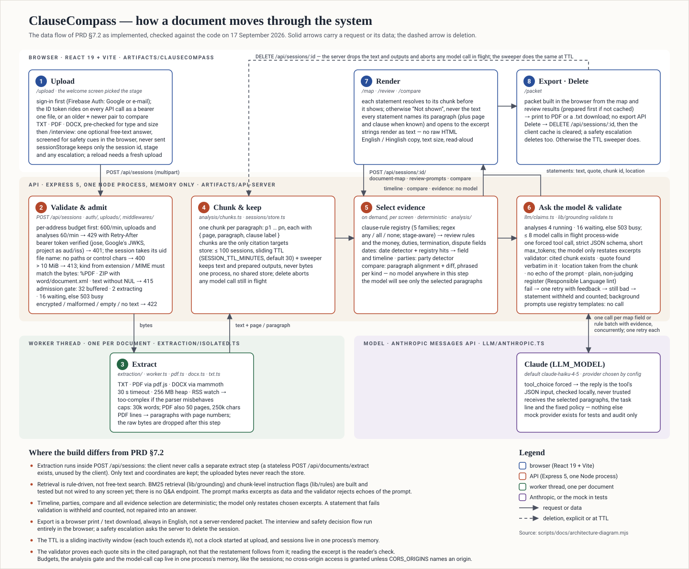

# docs/

- `PRD.md` - the product requirements this build follows. Section numbers referenced in code comments and commit messages point here.
- `architecture.svg` - the data flow of PRD §7.2 as built (below). Drawn by `scripts/docs/architecture-diagram.mjs`; edit the text there and rerun `node scripts/docs/architecture-diagram.mjs`. The box text was checked against the code on 17 September 2026, so re-check it when a step changes.
- `design.md` - the UI design specification for the web client: colour and type tokens, spacing and shape, component recipes with exact classes, every screen and its states, copy and accessibility rules, and the definition of done for a UI change. Written from the code on 15 September 2026; keep it in step with `artifacts/clausecompass/src`.
- `design-prompts.md` - the same specification as copy-paste prompt blocks: one project-context block (tokens, recipes, rules) plus one block per screen with layout order, exact classes, exact copy and states, and a checklist block. For handing the UI to another builder or agent; regenerate from `design.md` when that changes.
- Coming with later tasks: threat model, accessibility checklist, demo script.

## Architecture

Where each step lives (all paths under `artifacts/` and `lib/`):

| Step | Code |
| --- | --- |
| 1 Upload | `clausecompass/src/pages/welcome.tsx` (stage), `features/auth/` + `pages/sign-in.tsx` (the sign-in gate, `RequireAuth`; the bearer token is attached in `lib/api-client-react`'s fetcher), `pages/upload.tsx`, `features/document/` (pre-flight `validate-file.ts`, slots), `pages/interview.tsx` with `lib/rules/src/flow.ts` + `safety-cues.ts` (decision flow, safety cues), `features/journey/` (stage, escalation, session id) |
| 2 Validate & admit | `api-server/src/auth/` (`requireUser`: Firebase ID token verified with `jose`; session ownership in `sessions/store.ts` + `routes/sessions.ts`), `api-server/src/uploads/multipart.ts` + `file-name.ts`, `middlewares/extraction-gate.ts`, `extraction/sniff.ts`, `extraction/limits.ts`, `extraction/errors.ts` |
| 3 Extract | `api-server/src/extraction/isolated.ts` + `worker.ts` + `memory-watch.ts`, `txt.ts`, `pdf.ts`, `docx.ts`, `paragraphs.ts` |
| 4 Chunk & keep | `api-server/src/analysis/chunks.ts`, `lib/rules/src/clause-label.ts`, `api-server/src/sessions/store.ts` (TTL, sweeper, delete) |
| 5 Select evidence | `lib/rules/src/registry.ts` + `engine.ts`, `api-server/src/analysis/document-map.ts`, `dates.ts`, `parties.ts`, `review-prompts.ts`, `compare/` |
| 6 Ask the model & validate | `api-server/src/llm/prompt.ts`, `claims.ts`, `anthropic.ts`, `mock.ts`; `lib/grounding/src/validate.ts`, `language.ts` |
| 7 Render | `clausecompass/src/pages/document-map.tsx`, `review-prompts.tsx`, `compare.tsx`; `features/grounding/` (`resolve-claim.ts`, `source-card.tsx`, `format-location.ts`); `features/display/`, `features/speech/` |
| 8 Export · Delete | `clausecompass/src/features/packet/`, `pages/packet.tsx`; `features/journey/journey-context.tsx` (delete), `api-server/src/routes/sessions.ts` |

Built and tested but not wired to any screen yet (named in the diagram's notes, not drawn as steps): BM25 retrieval (`lib/grounding/src/retrieval.ts`), chunk-level instruction flags (`lib/rules/src/untrusted.ts`), the stateless `POST /api/documents/extract` route.
